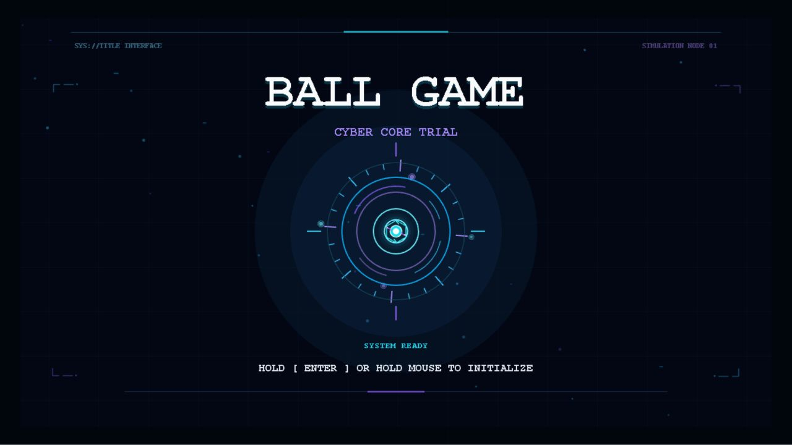
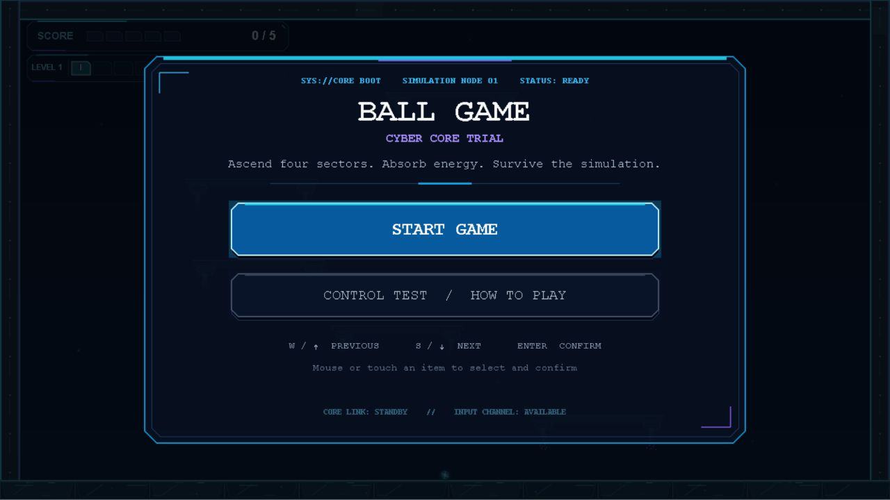
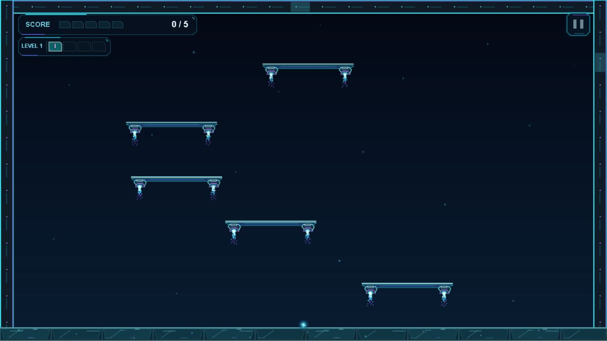
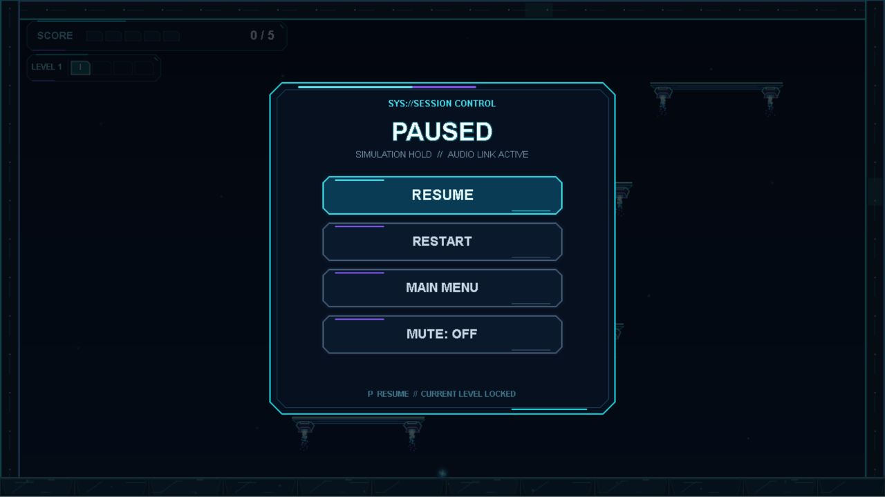

# LayaAir Ball Game

> A completed four-level cyber platformer built with **LayaAir 3** and **TypeScript**, combining custom one-way physics, progressive hazards, responsive feedback, and reproducible validation tooling.



**Status:** Feature-complete personal portfolio build with a full start-to-finish game flow.

### Watch and Play

- **Play Online:** [Play the final Web build](https://yangyjie134.github.io/layaair-ball-game/)
- **Full Gameplay & Features (3:50):** [Watch the complete gameplay and feature walkthrough](https://github.com/YangYjie134/layaair-ball-game/releases/download/web-demo-2026-09-03/BallGame-Full-Gameplay-Features-Final.mp4)
- **Short Gameplay Preview (53 sec):** [Watch the representative final-build capture](docs/showcase/ballgame-final-portfolio-capture.mp4)
- **Latest Release:** [Download the final Web build](https://github.com/YangYjie134/layaair-ball-game/releases/tag/web-demo-2026-09-03)


## Game Overview

Ball Game — Cyber Core Trial is a compact 2D platformer about guiding an energy core through four escalating simulation sectors. The player earns one point for each unique platform landing; five points clear the current level. Levels 1–3 advance through dedicated transitions, while Level 4 ends at a complete Game Complete screen with **Play Again** and **Main Menu** actions.

| | |
| --- | --- |
| Engine | LayaAir 3 |
| Language | TypeScript |
| Genre | 2D platformer |
| Scope | Four completed levels plus final completion flow |
| Platforms | Desktop keyboard and mobile touch |
| Role | Independently owned personal portfolio project |

## Core Features

- Cyber Cover initialization, main menu, physical-key control test, and mobile tutorial.
- Horizontal movement, jumping, scoring, level transitions, and core-energy feedback.
- Moving platforms, warned disappearing platforms with hide/rebuild states, and Level 4 spike hazards.
- Cyber death-reconstruction sequence followed by a clean gameplay rebuild.
- Pause, restart, main-menu, and global mute controls.
- Separate Cover, Menu, and Gameplay music roles with jump, score, death, and clear feedback.
- Dedicated final completion UI after all four levels.

## Gameplay and Presentation

<p align="center">
  
  
</p>

<p align="center">
  
</p>

The visual flow stays consistent from the hold-to-initialize Cover through menus, level-ready and level-clear transitions, gameplay feedback, reconstruction, pause controls, and the final completion state.

## Technical Highlights

- **LayaAir 3 + TypeScript:** gameplay, UI orchestration, audio roles, and presentation systems remain explicit and code-readable.
- **Purpose-built one-way platform physics:** the ball lands on platform tops while side and underside contacts remain non-blocking.
- **Constrained randomized Level 4 generation:** platform and hazard placement follows explicit rules instead of unconstrained random placement.
- **Deterministic seed replay:** recorded seeds make selected randomized cases reproducible for investigation.
- **Production-step validation:** targeted tools exercise the same `BallController.stepPhysics(...)` path used by runtime gameplay.
- **Authoritative session flow:** `Main.ts` owns intro, active play, pause, transitions, and completion; UI layers remain presentation-focused.

## Controls

| Action | Desktop | Mobile |
| --- | --- | --- |
| Move | `A` / `D` or left / right arrows | Left / right touch controls |
| Jump | `W` or up arrow | Jump touch control |
| Pause / resume | `P` or top-right Pause button | Top-right Pause button |
| Restart current level | Pause menu | Pause menu |
| Mute / unmute | `M` or Pause menu | Pause menu |
| Initialize Cover | Hold `Enter` or the left mouse button | Touch and hold |

## Level Overview

| Level | Player-facing progression |
| --- | --- |
| Level 1 | Core movement, jumping, landing, and scoring |
| Level 2 | Moving platforms |
| Level 3 | Moving platforms plus warned disappearing platforms and rebuild behavior |
| Level 4 | Moving platforms, disappearing platforms, spike hazards, and final completion |

## Advanced Validation Notes

Level 4 support combines constrained generation, deterministic seed replay, affected-jump identification, and targeted validation through the production physics step. These tools are used to reproduce and investigate selected layouts; they do not claim mathematical proof of fairness or universal solvability.

Historical manual acceptance is deliberately finite. An initial 30-layout sample completed 29 layouts normally, with one potentially unreachable result that could not be reproduced. A targeted follow-up covered 10 additional valid samples: eight completed normally and two ended after spike collisions, with no new potentially unreachable layout observed. No confirmed unreachable layout was found in those samples.

## Project Ownership

This is a personal portfolio project developed with AI-assisted implementation and review. Requirements, technical trade-offs, integration, debugging, verification, and final acceptance were owned by the developer.

## Run Locally

1. Open the repository folder in **LayaAir IDE 3**.
2. Run the main scene from the editor.
3. Hold `Enter` or the left mouse button for about 1.2 seconds to initialize the Cover.

For a downloaded Web build, extract the package and serve it through a local HTTP server instead of opening `index.html` with `file://`.

`package.json` does not define npm run scripts, so commands such as `npm run dev` or `npm start` are intentionally not documented.

Browser autoplay rules may defer Cover music until the first valid interaction. The Cover gesture retries playback while continuing the initialization flow.

## Key Runtime Files

```text
src/
├── Main.ts                 # Session flow, pause, transitions, and completion
├── BallController.ts       # Movement, collision, levels, hazards, and respawn
├── ScoreManager.ts         # Score state and player feedback
├── IntroUI.ts              # Cover, menu, control test, and tutorial entry
├── LevelTransition.ts      # Level-ready and level-clear presentation
├── GameCompleteUI.ts       # Final completion actions
├── PauseUI.ts              # Pause presentation and callbacks
├── TouchController.ts      # Mobile gameplay controls
├── TouchTutorialUI.ts      # Mobile onboarding flow
├── BgmManager.ts           # Cover, Menu, and Gameplay music roles
└── SfxManager.ts           # Sampled effects and procedural score feedback
```

## Audio, Credits, and Licensing

The final presentation uses multi-stage background music plus jump, score, death, and clear feedback, with a global mute control. Detailed source, license, role, and processing records are kept in [`assets/AUDIO_SOURCES.md`](assets/AUDIO_SOURCES.md).

No project-wide license is declared. Third-party engine, template, Box2D, and audio notices are documented in [`THIRD_PARTY_NOTICES.md`](THIRD_PARTY_NOTICES.md); that notice does not grant permission to reuse the project's original code, documentation, screenshots, or game design.

## 中文简介

**Ball Game — Cyber Core Trial** 是一个使用 **LayaAir 3 + TypeScript** 独立完成的四关赛博风格 2D 平台跳跃作品。玩家通过自定义单向平台物理完成跳跃与落点得分，四关依次加入移动平台、消失平台和尖刺，并由独立的最终通关界面收束完整流程。

当前版本包含 Cyber Cover、主菜单、实体按键测试、桌面与移动端输入、关卡转场、Pause、分数与核心能量反馈、死亡重构、分阶段音乐和音效。Level 4 配套受约束的随机生成、确定性 Seed Replay 与基于 production `stepPhysics(...)` 的定向验证工具。
