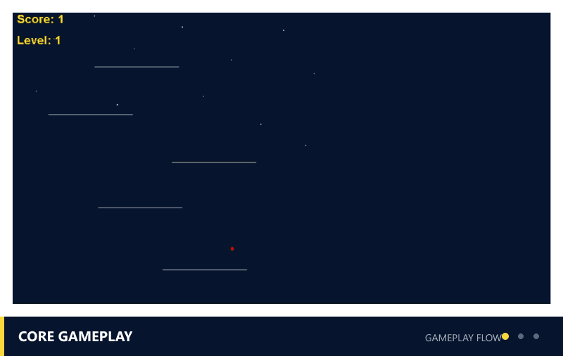
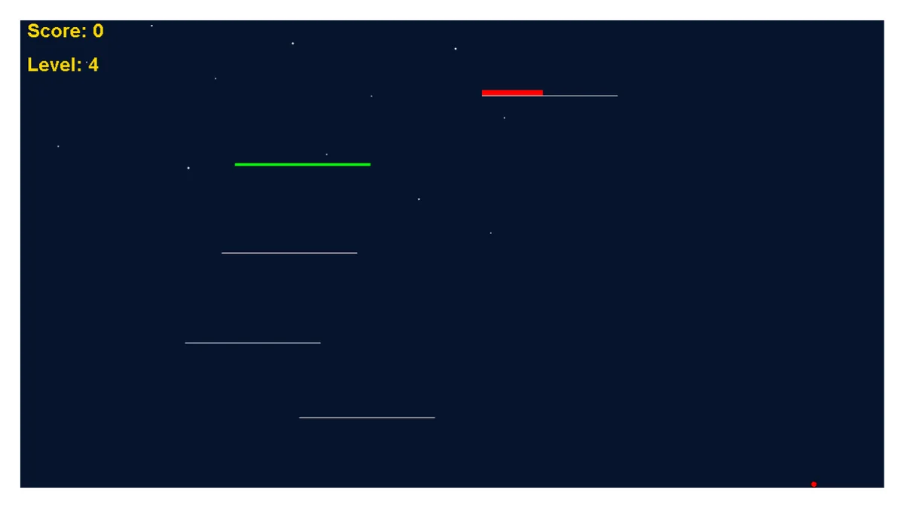
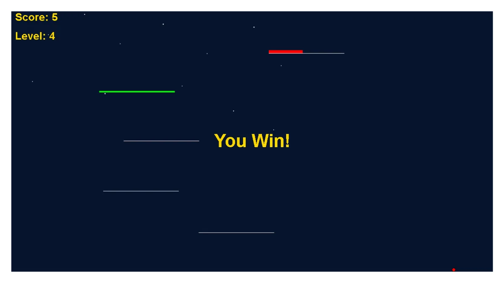

# LayaAir Ball Game

> Personal project / 个人项目 | Independently developed / 独立开发



*Gameplay flow preview assembled from captured in-game states: core gameplay, special platforms, and level clear.*

A completed four-level 2D platformer personal project built with **LayaAir 3** and **TypeScript**.

This is a finished learning and portfolio project, not a commercial release. It focuses on custom platformer physics, readable gameplay rules, randomized platform layouts, and a compact four-level game loop.

## Project Summary

The player controls a ball, jumps through platform layouts, scores by landing on platforms, and advances through four completed level rule sets. Later levels add moving platforms, disappearing platforms, and static spike hazards while keeping the core controls simple.

The project currently uses code-driven gameplay logic and a code-drawn background rather than relying only on scene-editor behavior.

Requirements, technical decisions, code integration, debugging, verification, and final acceptance were handled independently; AI tools were used as development assistants.

<p align="center">
  
  
</p>

## Play Online

- **Browser demo:** [Play LayaAir Ball Game](https://yangyjie134.github.io/layaair-ball-game/)
- **Downloadable Web build:** [Latest GitHub Release](https://github.com/YangYjie134/layaair-ball-game/releases/latest)

After the page loads, Cover music is requested immediately on a best-effort basis. Hold `Enter` or the left mouse button for about 1.2 seconds to initialize the desktop title cover; on mobile, touch and hold. If browser autoplay blocks the entry-time request, the first valid interaction retries it without blocking initialization.

## Current Status

- **Engine:** LayaAir 3
- **Language:** TypeScript
- **Genre:** 2D platformer
- **Current level loop:** Level 1 through Level 4, then loops back
- **Completed scope:** movement, jumping, collision, death / respawn, randomized layouts, special platforms, Level 4 hazards, and audio
- **Project stage:** completed learning / portfolio project
- **Development model:** personal project / independently developed

## Features

- Custom ball movement with gravity, horizontal acceleration, and jumping.
- Custom one-way platform collision for simple and controllable platformer behavior.
- Platform scoring with one score per platform touch.
- Death and respawn loop after falling back to danger areas or leaving the playable space.
- Randomized platform layouts after death and level reset.
- Moving platforms in later levels.
- Disappearing platforms with brighter warning colors and a visual highlight bar.
- Static spike hazards in Level 4.
- Hold-to-initialize title cover, main menu, and desktop/mobile control guides.
- Code-drawn background.
- Desktop/Mobile-optimized Cover and main-menu music, with the existing silent How to Play, startup transition, and first-use mobile tutorial lifecycle before gameplay music begins.
- Sound effects for jump, death, and level-clear.
- Global mute toggle for music and sound effects.

## Controls

| Action | Input |
| --- | --- |
| Move left / right | `A` / `D` or left / right arrow |
| Jump | `W` or up arrow |
| Advance after win | `R` |
| Initialize title cover (desktop) | Hold `Enter` or hold left mouse |
| Initialize title cover (mobile) | Touch and hold |
| Mute / unmute all audio | `M` |
| Pause / resume during active gameplay | `P` or the top-right Pause control |

## Audio Credits

All audio is CC0 (public domain). Attribution is not legally required under CC0, but
is provided here as good practice. See `assets/AUDIO_SOURCES.md` for per-file roles,
authors, source pages, licenses, and actual processing details.

* **Cover / main-menu music** — `transmission.mp3` and `sector.mp3`, by SRG774, from *Dark Sci-Fi Audio Pack*
  * https://opengameart.org/content/dark-sci-fi-audio-pack  (CC0 1.0)
* **Gameplay music** — "Ending / Credits", by Juhani Junkala / SubspaceAudio, from *5 Chiptunes (Action)*
  * https://opengameart.org/content/5-chiptunes-action  (CC0)
* **Sound effects** (jump / death / level-clear) — from *512 Sound Effects (8-bit style)*
  * https://opengameart.org/content/512-sound-effects-8-bit-style  (CC0)

## Level Design

| Level | Main Mechanics |
| --- | --- |
| Level 1 | Basic platform jumping |
| Level 2 | Moving platforms |
| Level 3 | Moving platforms and disappearing platforms |
| Level 4 | Moving platforms, disappearing platforms, and static spike hazards |

Current platform and hazard rules:

- Platform layouts are randomized as part of the restart / respawn loop.
- Spikes can appear on `Platform_1` through `Platform_5`.
- Spikes do not appear on `Ground`, moving platforms, or disappearing platforms.
- Disappearing platforms are not selected from the final platform.
- Disappearing platforms warn the player with brighter colors and a highlight bar before becoming inactive.

## Technical Notes

The game uses self-developed lightweight one-way platform physics instead of relying fully on Box2D contacts for platform behavior. This keeps the rules focused on the platformer use case: the ball lands on platform tops, but platform sides and bottom contacts do not need full rigid-body handling.

That direction was chosen after unstable platform-corner behavior made the built-in physics path harder to control for this prototype. The custom approach keeps collision rules, respawn behavior, and level reset behavior easier to reason about.

Per-frame gameplay physics is exposed through the shared production `BallController.stepPhysics(...)` step. Runtime gameplay and the Level 4 validation harness use this same production physics path rather than maintaining a separate copy of the movement and collision model.

Important runtime systems include:

- `BallController.ts` for movement, platform collision, level progression, hazards, respawn, and platform randomization.
- `ScoreManager.ts` for score tracking, win state, and platform score deduplication.
- `BackgroundManager.ts` for the code-drawn background.
- `IntroUI.ts` for the startup controls overlay.
- `BgmManager.ts` for background-music start / stop and volume.
- `SfxManager.ts` for jump, death, and level-clear sound effects.

## Level 4 Validation

Level 4's randomized layouts are supported by deterministic Seed Replay, affected-jump identification, and a validation harness that replays cases through the real production `stepPhysics` path. Together, these tools make generated layouts reproducible and keep offline checks tied to the game's production physics.

Manual acceptance evidence for the completed build is deliberately reported as a finite sample:

- Initial 30 randomized layouts: 29 completed normally; 1 appeared potentially unreachable but could not be reproduced.
- Follow-up testing targeted similar high-risk geometry with 10 additional valid samples: 8 completed normally; 2 ended after spike collisions, so their reachability remained undetermined; 0 new potentially unreachable layouts were observed.
- Across these finite samples, no confirmed unreachable randomized layout was found.

This is **not** a complete mathematical proof of reachability or fairness and should not be read as a guarantee covering every possible randomized layout.

## Project Structure

```text
src/
├── Main.ts                # Entry point for startup systems
├── BallController.ts      # Core player, platform, level, respawn, and hazard logic
├── ScoreManager.ts        # Score and win-state management
├── BackgroundManager.ts   # Code-drawn background
├── IntroUI.ts             # Title-cover Hold flow, main menu, and control guides
├── BgmManager.ts          # Cover / menu / gameplay music roles and playback
└── SfxManager.ts          # Jump, death, and level-clear sound effects
```

## How to Run

1. Open the repository folder with **LayaAir IDE 3**.
2. Run the main scene from the editor.
3. Hold `Enter` or the left mouse button to initialize the title cover, then use the controls listed above.

For the downloadable Web build, extract the Release archive and use a local HTTP server rather than opening it with `file://`. The hosted GitHub Pages build is linked in **Play Online** above.

`package.json` currently does not define npm scripts, so this README intentionally does not document `npm run dev`, `npm start`, or similar commands.

## Development Notes

- The project is intentionally small and code-readable.
- The intended four-level gameplay, hazard, audio, respawn, and validation scope is complete.
- The current architecture favors explicit TypeScript gameplay logic over broad engine abstraction.
- Respawn, platform reset, and randomized layout behavior are core parts of the game loop.

## Known Limitations

- Cover music is requested on Cover entry, but browser autoplay policy may defer it until the first valid interaction.
- The hosted and downloadable builds are portfolio Web demos, not commercial or store releases.

## Licensing

No project-wide license is currently declared. Third-party engine files, LayaAir template assets, Box2D code present in generated output, and CC0 audio are documented separately in [`THIRD_PARTY_NOTICES.md`](THIRD_PARTY_NOTICES.md). That notice does not grant permission to reuse the project's original code, documentation, screenshots, or game design.

## Optional Future Polish

The current project scope is complete. Possible future additions are optional rather than required for the finished four-level build:

- UI polish.
- More level variety.
- Difficulty balancing.
- Better visual feedback.

## 中文简要说明

这是一个使用 **LayaAir 3 + TypeScript** 制作并已完成的四关 2D 小球平台跳跃项目，定位是学习和作品集展示项目，而不是商业化成品。

当前已经实现 Level 1 到 Level 4 的循环玩法，包括基础跳跃、移动平台、消失平台、静态尖刺、死亡复活、平台随机刷新、开场操作提示和代码绘制背景。音频方面已加入背景音乐、跳跃/死亡/过关音效，以及 M 键全局静音。项目重点是用自定义单向平台物理来保持平台跳跃规则简单、可控，并方便继续扩展关卡机制。

工程侧使用自研轻量物理与共享 production `stepPhysics`，并配套 deterministic Seed Replay、affected-jump identification 和基于真实 production physics 的 validation harness。L4 验收结论来自有限样本，不构成完备的可达性或公平性数学证明。
